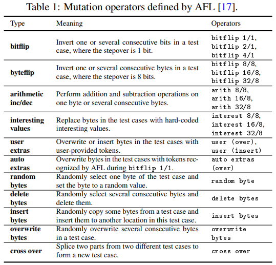

JANUS 는 forkserver, coverage bitmap, test-case scheduling algorithm 을 포함한 기본 구조가 AFL과 동일하다고 한다.!!!


그렇다면 AFL을 확인하고 AFL과 바뀐 부분을 중점적으로 살펴보자.
다음은 AFL의 mutation 연산자들이다.



다음은 AFL의 mutation 스케쥴링 구조이다.


상단의 그림을 보면 

1. deterministic stage, Havoc stage, Splicing stage 3개의 stage가 있다. 
JANUS는 deterministic stage, Splicing stage를 모두 생략하고 바로 Havoc stage를 사용한다.


이제 변경된 부분을 보자.
다음은 JANUS에서 추가한 헤더파일이다.
```C
#include <sys/sendfile.h>
#include <mutator_wrapper.hpp>
```

```C
int main(int argc, char** argv) {
```

JANUS에서 추가된 옵션
```C
      case 'u': /* CPU# */
	        if (sscanf(optarg, "%u", &cpu_id) != 1)
	          PFATAL("Invalid CPU#");

	  case 'g': /* image path */
		image_file = optarg;
	        OKF("[fs-fuzz] target image path: %s", image_file);

	
      case 'k': /* kernel fuzz mode */
		OKF("We are now fuzzing kernel");
	 
	  case 'b': /* shm name */
		shm_name = optarg;
		fsfuzz_mode = 1;
	        OKF("[fs-fuzz] shm name to store image buffer: %s", shm_name);

	  
	  case 's': /* wrapper.so path */
		wrapper_file = optarg;
		fsfuzz_mode = 1;
	        OKF("[fs-fuzz] target wrapper (.so) path: %s", wrapper_file);
	  
	  case 'e': /* seed */
		seed_file = optarg;
		fsfuzz_mode = 1;
	        OKF("[fs-fuzz] seed image path: %s", seed_file);

	  case 'y' : /* syscall input dir */
		syscall_in_dir = optarg;
		fsfuzz_mode = 1;
	        OKF("[fs-fuzz] syscall input directory: %s", syscall_in_dir);


```
JANUS 에서 추가한 함수
```C
setup_wrapper()
write_execs_file()
load_seed_image()
load_syscalls()

```
JANUS 에서 추가한 변수
```C
static u32 cpu_id = -1;
static u32 fsfuzz_mode = 0;
static u32 meta_size = 0;
u32 fsfuzz_queued;
u32 _step = 1;
EXP_ST u8 *image_file,	  		/* for fs fuzzing					  */
	  *wrapper_file,	  	/* for fs fuzzing					  */
	  *seed_file,	  		/* for fs fuzzing 					  */
	  *syscall_in_dir,         	/* for fs fuzzing					  */
	  *shm_name;	 		/* for fs fuzzing					  */

u32 orig_queued_with_cov; // 
```

1) JANUS에선 Trimming을 하지 않는다.

```C
  /************
   * TRIMMING *
   ************/

   // fs-fuzz: we cannot arbitrary trim for now...

  if (!fsfuzz_mode && !dumb_mode && !queue_cur->trim_done) {


```

fuzz_one 스케쥴링 확인!!

```C
static u8 fuzz_one(char** argv) {

  s32 len, fd, temp_len, i, j;
  u8  *in_buf, *out_buf, *orig_in, *ex_tmp, *eff_map = 0;
  u64 havoc_queued,  orig_hit_cnt, new_hit_cnt;
  u32 splice_cycle = 0, perf_score = 100, orig_perf, prev_cksum, eff_cnt = 1;
  u32 orig_queued_with_cov;

  u8  ret_val = 1, doing_det = 0;

  u8  a_collect[MAX_AUTO_EXTRA];
  u32 a_len = 0;

  if (queue_cur->depth > 1) return 1;

  if (pending_favored) {

    /* If we have any favored, non-fuzzed new arrivals in the queue,
       possibly skip to them at the expense of already-fuzzed or non-favored
       cases. */

    if ((queue_cur->was_fuzzed || !queue_cur->favored) &&
        UR(100) < SKIP_TO_NEW_PROB) return 1;

  } else if (!dumb_mode && !queue_cur->favored && queued_paths > 10) {

    /* Otherwise, still possibly skip non-favored cases, albeit less often.
       The odds of skipping stuff are higher for already-fuzzed inputs and
       lower for never-fuzzed entries. */

    if (queue_cycle > 1 && !queue_cur->was_fuzzed) {

      if (UR(100) < SKIP_NFAV_NEW_PROB) return 1;

    } else {

      if (UR(100) < SKIP_NFAV_OLD_PROB) return 1;

    }

  }

  if (not_on_tty) {
    ACTF("Fuzzing test case #%u (%u total, %llu uniq crashes found)...",
         current_entry, queued_paths, unique_crashes);
    fflush(stdout);
  }

  /* 테스트 케이스를 메모리에 매핑. */
  fd = open(queue_cur->fname, O_RDONLY);
  len = queue_cur->len;
  orig_in = in_buf = mmap(0, len, PROT_READ | PROT_WRITE, MAP_PRIVATE, fd, 0);
  close(fd);

  out_buf = ck_alloc_nozero(len);
  subseq_tmouts = 0;
  cur_depth = queue_cur->depth;

  if (queue_cur->cal_failed) {
    if (queue_cur->cal_failed < CAL_CHANCES) {  
    	CALIBRATION 수행
    }
  }

  memcpy(out_buf, in_buf, len);

  /* 스코어 계산. */
  orig_perf = perf_score = calculate_score(queue_cur);
  goto havoc_stage;
```

havoc 스테이지 !!
```C

havoc_stage:

  stage_cur_byte = -1;

  if (!splice_cycle) {	//splice 

    stage_name  = "havoc";
    stage_short = "havoc";
    stage_max   = (doing_det ? HAVOC_CYCLES_INIT : HAVOC_CYCLES) *
                  perf_score / havoc_div / 100;

  } else {

    static u8 tmp[32];
    perf_score = orig_perf;
    sprintf(tmp, "splice %u", splice_cycle);
    stage_name  = tmp;
    stage_short = "splice";
    stage_max   = SPLICE_HAVOC * perf_score / havoc_div / 100;

  }

  if (stage_max < HAVOC_MIN) stage_max = HAVOC_MIN; //stage_max = 16

  temp_len = fsfuzz_mode ? meta_size : len;

  orig_hit_cnt = queued_paths + unique_crashes;

  orig_queued_with_cov = queued_with_cov;

  havoc_queued = queued_paths;

```

cov
```C

  //랜덤으로 수천개를 꼬아보고 비틀어 본다.
  for (stage_cur = 0; stage_cur < stage_max; stage_cur++) {

    u32 use_stacking = 1 << (1 + UR(HAVOC_STACK_POW2)); // UR() - 1 을 난수만큼 왼쪽으로 shift 연산
    stage_cur_val = use_stacking;

    for (i = 0; i < use_stacking; i++) { // 1-128 번 비트를 꼬거나 바꾼다.

      // switch (UR(15 + ((extras_cnt + a_extras_cnt) ? 2 : 0))) { // AFL은 16개의 case 활용
      switch (UR(12 + ((extras_cnt + a_extras_cnt) ? 1 : 0))) {    // JANUS는 12개의 case 활용

        case 0: /* Flip a single bit somewhere. Spooky! */ FLIP_BIT(out_buf, UR(temp_len << 3)); 
        case 1: /* Set byte to interesting value. */ out_buf[UR(temp_len)] = interesting_8[UR(sizeof(interesting_8))]; 
        case 2: /* Set word to interesting value, randomly choosing endian. */
        case 3: /* Set dword to interesting value, randomly choosing endian. */
        case 4: /* Randomly subtract from byte. */ out_buf[UR(temp_len)] -= 1 + UR(ARITH_MAX);
        case 5: /* Randomly add to byte. */ out_buf[UR(temp_len)] += 1 + UR(ARITH_MAX); 
        case 6: /* Randomly subtract from word(16비트), random endian. */ 
        case 7: /* Randomly add to word, random endian. */
        case 8: /* Randomly subtract from dword, random endian. */
        case 9: /* Randomly add to dword, random endian. */
        case 10:/* Just set a random byte to a random value. Because,
		     why not. We use XOR with 1-255 to eliminate the
		     possibility of a no-op. */
        case 11:/* Overwrite bytes with a randomly selected chunk (75%) or fixed bytes (25%). */
        case 12:/* Overwrite bytes with an extra. */
    }

```

for문을 돌고 난 후 common_fuzz_stuff 함수에 비틀어 놓은 인자(out_buf) 를 집어 넣어서 버릴 지 말지 확인.

```C

    if (common_fuzz_stuff(argv, out_buf, len))		// 중요한 단계  
      goto abandon_entry;

    memcpy(out_buf, in_buf, temp_len); 			// 버리지 않는다면 out_buf 를 in_buf에 복사.(feed-back)

    if (queued_paths != havoc_queued) {			

      if (perf_score <= HAVOC_MAX_MULT * 100) {
        stage_max  *= 2;
        perf_score *= 2;
      }

      havoc_queued = queued_paths;

    }
  }

  new_hit_cnt = queued_paths + unique_crashes;

  if (!splice_cycle) {
    stage_finds[STAGE_HAVOC]  += new_hit_cnt - orig_hit_cnt;
    stage_cycles[STAGE_HAVOC] += stage_max;
  } else {
    stage_finds[STAGE_SPLICE]  += new_hit_cnt - orig_hit_cnt;
    stage_cycles[STAGE_SPLICE] += stage_max;
  }

  if (queued_with_cov > orig_queued_with_cov)
    goto ret;
  else
    goto fsfuzz_stage;

```

JANUS는 splicing stage는 안함.

```C

fsfuzz_stage:

```

