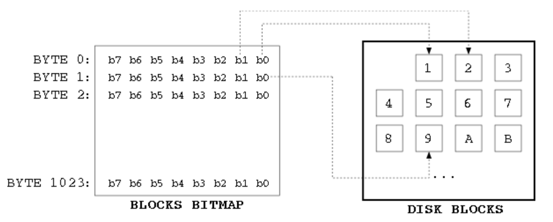

```C
#include "ext4_fuzzer.hh"
#include "utils.hh"

#include <set>
#include <string>
#include <algorithm>

#include <sys/sendfile.h>
#include <sys/types.h>
#include <sys/stat.h>
#include <fcntl.h>
#include <stdint.h>
#include <unistd.h>

#include "ext2fs/ext2_fs.h"
#include "ext2fs/ext2fs.h"
#include "config.h"

#define JOURNAL
#define JOURNAL_INO 8

struct find_block {
  struct ext2_inode *inode;
  std::set<uint64_t> block_indexes;
};

/* 함수명 : find_block_helper
   파라미터 : blocknr 
	     blockcnt
	     priv_data
   함수설명 : 
*/
static int find_block_helper(ext2_filsys fs EXT2FS_ATTR((unused)),
			     blk64_t *blocknr, e2_blkcnt_t blockcnt,
			     blk64_t ref_blk EXT2FS_ATTR((unused)),
			     int ref_offset EXT2FS_ATTR((unused)),
			     void *priv_data)
{
    struct find_block *fb = (struct find_block *)priv_data;
	if (S_ISDIR(fb->inode->i_mode) || blockcnt < 0) {
		// ext2fs_mark_block_bitmap2(fb->bitmap, *blocknr);
		fb->block_indexes.insert(*blocknr);
	}

	return 0;
}

/* 함수명 : find_super_and_bgd
   파라미터 : fs
	     group
	     *fb
   함수설명 : super block, block group descriptors 를 찾아 
*/
static int find_super_and_bgd(ext2_filsys fs, dgrp_t group, struct find_block *fb)
{
	blk64_t	super_blk, old_desc_blk, new_desc_blk;
	blk_t	used_blks;
	int	old_desc_blocks, num_blocks;

	ext2fs_super_and_bgd_loc2(fs, group, &super_blk,
				  &old_desc_blk, &new_desc_blk, &used_blks);

	if (ext2fs_has_feature_meta_bg(fs->super))
		old_desc_blocks = fs->super->s_first_meta_bg;
	else
		old_desc_blocks = fs->desc_blocks + fs->super->s_reserved_gdt_blocks;

	if (super_blk || (group == 0))
		// ext2fs_mark_block_bitmap2(bmap, super_blk);
		fb->block_indexes.insert(super_blk);
		
	if ((group == 0) && (fs->blocksize == 1024) &&
	    EXT2FS_CLUSTER_RATIO(fs) > 1)
		// ext2fs_mark_block_bitmap2(bmap, 0);
		fb->block_indexes.insert(0);

	if (old_desc_blk) {
		num_blocks = old_desc_blocks;
		if (old_desc_blk + num_blocks >= ext2fs_blocks_count(fs->super))
			num_blocks = ext2fs_blocks_count(fs->super) - old_desc_blk;
		// ext2fs_mark_block_bitmap_range2(bmap, old_desc_blk, num_blocks);
		// for (blk64_t i = old_desc_blk; i < old_desc_blk + std::min(num_blocks, int(2)); i++)
		for (blk64_t i = old_desc_blk; i < old_desc_blk + num_blocks; i++)
			fb->block_indexes.insert(i);
	}
	if (new_desc_blk)
		// ext2fs_mark_block_bitmap2(bmap, new_desc_blk);
		fb->block_indexes.insert(new_desc_blk);

	num_blocks = ext2fs_group_blocks_count(fs, group);
	num_blocks -= 2 + fs->inode_blocks_per_group + used_blks;

	return num_blocks;
}

/* 함수명 : find_metadata_blocks
   파라미터 : fs
	     *fb
   함수설명 : 
*/
static errcode_t find_metadata_blocks(ext2_filsys fs, struct find_block *fb)
{
  blk64_t b, c;			//블록 b,c 선언
  ext2_inode_scan scan;		//inode scanner
  ext2_ino_t ino;		//
  struct ext2_inode inode;	//ext2의 inode 구조체 선언
  errcode_t retval;		//

  for (dgrp_t i = 0; i < fs->group_desc_count; i++) {
    
    find_super_and_bgd(fs, i, fb);	// 슈퍼블록과 bgd 를 찾는다

    b = ext2fs_block_bitmap_loc(fs, i);	// 디스크에서 비트맵을 통해 block의 위치를 찾아 b에 저장.
```
비트맵 참조!



```C
    fb->block_indexes.insert(b);

    b = ext2fs_inode_bitmap_loc(fs, i);
    fb->block_indexes.insert(b);

    c = ext2fs_inode_table_loc(fs, i);
    // for (blk64_t j = c; j < c + std::min(fs->inode_blocks_per_group, uint32_t(2)); j++) {
    for (blk64_t j = c; j < c + fs->inode_blocks_per_group; j++) {
        fb->block_indexes.insert(j);
    }

  }

  /* scan inodes */
  fb->inode = &inode;
  memset(&inode, 0, sizeof(inode));

  retval = ext2fs_open_inode_scan(fs, 0, &scan);
  if (retval)
    goto out;

  retval = ext2fs_get_next_inode_full(scan, &ino, &inode, sizeof(inode));
  if (retval)
    goto out2;

  while (ino) {
    if (inode.i_links_count == 0)
      goto next_loop;

    b = ext2fs_file_acl_block(fs, &inode);
    if (b) {
        fb->block_indexes.insert(b);
    }

    if ((inode.i_flags & EXT4_INLINE_DATA_FL) ||
        S_ISLNK(inode.i_mode) || S_ISFIFO(inode.i_mode) ||
        S_ISCHR(inode.i_mode) || S_ISBLK(inode.i_mode) ||
        S_ISSOCK(inode.i_mode))
          goto next_loop;

      retval = ext2fs_block_iterate3(fs, ino, BLOCK_FLAG_READ_ONLY,
                                NULL, find_block_helper, fb);
   	
    if (retval)
      goto out2;

next_loop:
    retval = ext2fs_get_next_inode_full(scan, &ino, &inode, sizeof(inode));
    if (retval)
      goto out2;
  }
 
out2:
   ext2fs_close_inode_scan(scan);
out:

	return 0;
}

/* 함수명 : fix_checksum
   파라미터 : -
   함수설명 : 
*/
void ext4_fuzzer::fix_checksum() 
{
  /* enable INCOMPAT_RECOVER */
/*
#ifdef JOURNAL
  uint32_t s_feature_incompat;
  memcpy(&s_feature_incompat,
      (char *)image_buffer_ + 0x400 + 0x60,
      sizeof(uint32_t));
  s_feature_incompat |= 0x4;
  memcpy((char *)image_buffer_ + 0x400 + 0x60,
      &s_feature_incompat,
      sizeof(uint32_t));
#endif
*/

  /* disable RO_COMPAT_GDT_CSUM and RO_COMPAT_METADATA_CSUM */
  uint32_t s_feature_ro_compat;

  memcpy(&s_feature_ro_compat, 
        (char *)image_buffer_ + 0x400 + 0x64, 
        sizeof(uint32_t));
  s_feature_ro_compat &= ~0x0410;

  memcpy((char *)image_buffer_ + 0x400 + 0x64,
        &s_feature_ro_compat,
        sizeof(uint32_t));
}


/* 함수명 : fix_general_checksum
   파라미터 : -
   함수설명 : 
*/
void ext4_fuzzer::fix_general_checksum() 
{
  /* disable RO_COMPAT_GDT_CSUM and RO_COMPAT_METADATA_CSUM */
  uint32_t s_feature_ro_compat;

  memcpy(&s_feature_ro_compat, 
        (char *)image_buffer_ + 0x400 + 0x64, 
        sizeof(uint32_t));
  s_feature_ro_compat &= ~0x0410;

  memcpy((char *)image_buffer_ + 0x400 + 0x64,
        &s_feature_ro_compat,
        sizeof(uint32_t));
}


/* 함수명 : compress
   파라미터 : in_path
	     buffer
	     meta_path
   함수설명 : 
*/
void ext4_fuzzer::compress( const char *in_path, void *buffer, const char *meta_path) 
{
  bool generate_meta_image = meta_path != NULL;
  
  errcode_t ret;
  ext2_filsys fs = NULL;
  ext2fs_block_bitmap bitmap;
  struct find_block fb;

  ret = ext2fs_open(in_path, EXT2_FLAG_64BITS, 0, 0, unix_io_manager, &fs); //in_path에 있는 파일시스템을 fs(ext2fs)로 받아온다.

  if (ret)
    FATAL("[-] image %s compression failed.", in_path);

  find_metadata_blocks(fs, &fb);			//메타데이터 블록을 찾는다.

  block_size_ = 1 << (10 + fs->super->s_log_block_size);
  block_count_ = fs->super->s_blocks_count;

  image_size_ = block_size_ * block_count_;

  int in_image_fd = open(in_path, O_RDONLY);
  if (in_image_fd < 0)
    FATAL("[-] image %s compression failed.", in_path);

  image_buffer_ = buffer;
  if (read(in_image_fd, image_buffer_, image_size_) != image_size_) {
    perror("compress");
    FATAL("[-] image %s compression failed.", in_path);
  }

  close(in_image_fd);

#ifdef JOURNAL
  fb.block_indexes.insert(8); // 8: journal inode
  bool descr_start = false;
  for (uint64_t i = 0; i < block_count_; i++) {
    uint32_t magic = *(uint32_t *)((char *)image_buffer_ + i * block_size_);
    if (magic == 0x98393bc0) {
      fb.block_indexes.insert(i);

      uint32_t h_type;
      memcpy(&h_type,
        (char *)image_buffer_ + i * block_size_ + 0x4,
        sizeof(uint32_t));
      if (h_type == 0x1000000)
        descr_start = true;
      else if (h_type == 0x2000000)
        descr_start = false;
    } else if (descr_start) {
      fb.block_indexes.insert(i);
    }
  }
#endif

  char zeros[64];
  memset(zeros, 0, sizeof(zeros));
  for (auto it = fb.block_indexes.begin(); it != fb.block_indexes.end(); ) {
    char buf[64];
    memcpy(buf, ((char *)image_buffer_ + (*it) * block_size_), 64);
    if (!memcmp(zeros, buf, 64))
        fb.block_indexes.erase(it++);
    else
        it++;
  }

  int meta_image_fd = -1;
  if (generate_meta_image) {
    meta_image_fd = open(meta_path, O_CREAT | O_RDWR | O_TRUNC, 0666);
    if (meta_image_fd < 0)
      FATAL("[-] image %s compression failed.", in_path);
  }

  if (!release_metadata(fb.block_indexes, meta_image_fd, true))
    FATAL("[-] image %s compression failed.", in_path);

  ext2fs_close_free(&fs);

  if (generate_meta_image)
    close(meta_image_fd);

  // print_metadata();

}


/* 함수명 : decompress
   파라미터 : meta_buffer
	     meta_len
	     checksum
   함수설명 : 
*/
void ext4_fuzzer::decompress(
    const void *meta_buffer,
    size_t meta_len,
    bool checksum) {

  size_t meta_offset = 0;

  for (extent_t &extent : metadata_) {
    memcpy((char *)image_buffer_ + extent.first, 
          (char *)meta_buffer + meta_offset, extent.second);
    meta_offset += extent.second;
  }

  if (checksum)
    fix_checksum();

}


/* 함수명 : general_decompress
   파라미터 : meta_buffer
	     meta_len
	     checksum
   함수설명 : 
*/
void ext4_fuzzer::general_decompress(
    const void *meta_buffer,
    size_t meta_len,
    bool checksum) {

  size_t meta_offset = 0;

  for (extent_t &extent : metadata_) {
    memcpy((char *)image_buffer_ + extent.first, 
          (char *)meta_buffer + meta_offset, extent.second);
    meta_offset += extent.second;
  }

  assert(meta_offset == meta_len);

  if (checksum)
    fix_general_checksum();

}
```


